<div align="center">



<br/>

# DevOS

**Arch Linux for developers who want everything working on day one.**  
XFCE desktop · LTS kernel · Calamares GUI installer · Apple MacBook ready.

<br/>

[](https://archlinux.org)
[](https://github.com/SalDevX/devos/releases)
[](https://archlinux.org/packages/core/x86_64/linux-lts/)
[](https://calamares.io)
[](#apple-macbook-support)
[](LICENSE)

<br/>

[**Live Installer Preview →**](https://SalDevX.github.io/devos/installer-preview.html)
&nbsp;&nbsp;·&nbsp;&nbsp;
[**Build the ISO →**](#build-the-iso)
&nbsp;&nbsp;·&nbsp;&nbsp;
[**What's Included →**](#whats-included)

</div>

---

## What is DevOS?

DevOS is a custom Arch Linux distribution assembled from a battle-tested developer workstation. It ships as a **bootable ISO** with a friendly **Calamares GUI installer** — no manual partitioning commands, no `pacstrap`, no post-install configuration marathon.

Boot the ISO. Click through the installer. Reboot into a fully configured XFCE desktop with your browser, editor, container runtime, and dev toolchain already in place.

> The realtime-audio / DAW variant (dwm, `linux-rt`, JACK, LV2 plugins) is the separate **MusicOS** project — DevOS is the developer workstation build.

---

## Desktop

| | |
|:---|:---|
| **Window Manager** | XFCE 4 with xfwm4 compositing |
| **Theme** | WhiteSur-Light GTK · Gruvbox-Plus-Dark icons |
| **Dock** | Plank (macOS-style bottom dock) |
| **App Overview** | xfdashboard — 4-finger swipe-up for GNOME-Shell-style overlay |
| **Terminal** | Alacritty → tmux → zsh with Powerlevel10k |
| **Login** | TTY autologin → startx → XFCE (no display manager) |
| **Gestures** | libinput-gestures: 4-finger swipe-up = overview, 3-finger = workspace switch |

---

## What's Included

<details>
<summary><strong>Browser &amp; Communication</strong></summary>

- **Brave** (stable, `brave-bin`) — tuned flags for Intel GPU compatibility
- Chromium, Firefox available via pacman/AUR post-install

</details>

<details>
<summary><strong>Development Tools</strong></summary>

- **VS Code** (`visual-studio-code-bin`)
- **Docker** + docker-compose (opt-in, see [Docker](#docker))
- **Node 20** + npm, yarn, GitHub CLI (`gh`), vsce, playwright
- **Python 3.14** + pip, agate, httpx, opentelemetry stack
- **Git** + delta pager
- **Paru** AUR helper
- **PlatformIO** + udev rules for embedded hardware (Arduino, J-Link, Microchip, EFR)

</details>

<details>
<summary><strong>System &amp; Utilities</strong></summary>

- `htop`, `btop`, `nvtop`, `iotop` — system monitors
- `bat`, `eza`, `fd`, `ripgrep`, `fzf`, `zoxide`, `tldr` — modern CLI replacements
- `ncdu`, `duf` — disk usage
- `tmux` + Oh-My-Tmux config
- `mdcat`, `tiv`, `ccze`, `cfonts`, `neofetch` — terminal eye candy
- `cups`, `cronie`, `acpid`, `tlp`, `bluetooth` — hardware services
- `ufw` + `fail2ban` — firewall and intrusion protection

</details>

<details>
<summary><strong>Security Hardening</strong></summary>

- Root account **locked** — access only via `sudo` from the `wheel` group
- `sudo` drop-in validated with `visudo -cf` at build time
- **UFW** firewall enabled by default (deny-all inbound)
- **fail2ban** enabled for SSH and other services
- **sshd disabled** by default — enable after setting a real password
- Live ISO password **expired at first login** — forces password change on installed system
- IPv6 disabled by default via `sysctl.d`
- `systemd-resolved` with local DNS stub

</details>

---

## Apple MacBook Support

DevOS ships with full Apple MacBook hardware support out of the box. No post-install driver hunting.

| Hardware | Solution | Status |
|:---|:---|:---:|
| Broadcom BCM WiFi | `broadcom-wl` DKMS · conflicting drivers blacklisted | ✅ |
| Intel Iris Pro / HD Graphics | `xf86-video-intel` · TearFree · DRI3 | ✅ |
| Magic Trackpad 2 | `hid-magicmouse` DKMS · libinput pressure curves | ✅ |
| Magic Mouse 2 | `hid-magicmouse` DKMS · udev acceleration | ✅ |
| FaceTime HD Camera | `facetimehd` DKMS | ✅ |
| Thunderbolt 2 | Native kernel support | ✅ |
| Fan control | `mbpfan` service | ✅ |
| Built-in Display Audio | Disabled at boot (prevents HDMI conflicts) | ✅ |
| USB SuperDrive | udev rule | ✅ |
| Clamshell / lid | `acpid` handler · logind defer · external display handoff | ✅ |
| Battery alerts | systemd user timer | ✅ |
| Suspend / resume | `acpid` + `tlp` | ✅ |

WiFi connects automatically on first boot. The `wl` module loads at boot — open `nmtui` or click the panel applet to choose your network.

---

## System Requirements

| | Minimum | Recommended |
|:---|:---|:---|
| **CPU** | x86_64, 2 cores | Intel Core i5+ (Haswell or newer) |
| **RAM** | 2 GB | 8 GB+ |
| **Storage** | 20 GB | 60 GB+ SSD |
| **Firmware** | UEFI | UEFI (systemd-boot) |
| **Network** | Ethernet or Broadcom/Intel WiFi | — |

---

## Installation

### Option A — GUI (Calamares)

1. Write the ISO to a USB drive:
   ```bash
   sudo dd if=devos-*.iso of=/dev/sdX bs=4M status=progress oflag=sync
   ```
2. Boot the USB on your target machine
3. Connect to WiFi via the panel applet (Broadcom loads automatically)
4. Double-click **"Install DevOS"** on the desktop
5. Follow the steps: Location → Keyboard → Partitions → Users → Install → Reboot

The installer erases the selected disk and configures `systemd-boot` with a GPT layout: 512 MiB ESP + ext4 root.

### Option B — CLI (install.sh)

For headless or scripted installs:

```bash
# 1. Partition and format
cfdisk /dev/sdX              # GPT: sdX1 = 512 MiB EFI, sdX2 = rest Linux
mkfs.fat -F32 /dev/sdX1
mkfs.ext4     /dev/sdX2

# 2. Mount
mount          /dev/sdX2 /mnt
mount --mkdir  /dev/sdX1 /mnt/boot

# 3. Run installer
sudo bash /opt/devos/installer/install.sh
```

`install.sh` runs `pacstrap`, generates `fstab`, applies the system overlay, installs `systemd-boot`, and auto-fills the root PARTUUID — no manual loader entry editing.

---

## First Login

| | |
|:---|:---|
| **Username** | `user` |
| **Password** | `user` (expired — you will be prompted to change it immediately) |
| **Root** | Locked — use `sudo` |

`startx` launches automatically on tty1; XFCE starts.

```bash
# Suggested first steps
passwd                              # set your real password
sudo pacman -Syu                    # sync and upgrade all packages
paru -S <aur-package>               # install AUR packages with paru
sudo systemctl enable --now sshd    # enable SSH (only after setting a real password)
```

---

## Docker

Docker is opt-in and not pre-enabled:

```bash
sudo systemctl enable --now docker
sudo usermod -aG docker "$USER"     # log out and back in to apply group
```

---

## Build the ISO

Build from source on any Arch Linux system:

```bash
sudo pacman -S archiso git
git clone https://github.com/SalDevX/devos
cd devos
sudo mkarchiso -v -w /tmp/devos-work -o ./out .
```

### Including AUR packages

`packages.x86_64` is official-repo only. For a full build with Brave, Calamares, xfdashboard, and 112 other AUR packages, pre-build a local repo:

```bash
./tools/build-aur-repo.sh ~/devos-local    # builds all 115 AUR packages
# Uncomment [devos-local] in pacman.conf, then re-run mkarchiso
```

---

## Repo Layout

```
devos/
├── profiledef.sh              archiso ISO metadata
├── packages.x86_64            470 official-repo packages
├── aur-build-list.txt         115 AUR packages (priority-ordered)
├── pacman.conf                build repos (+ optional [devos-local])
├── airootfs/
│   ├── etc/
│   │   ├── calamares/         GUI installer config, branding, scripts
│   │   ├── skel/              Default user dotfiles (zsh, alacritty, xfce4)
│   │   ├── modprobe.d/        Broadcom wl + conflicting driver blacklist
│   │   ├── systemd/system/    Apple hardware services, firstboot, autologin
│   │   └── X11/xorg.conf.d/   Intel TearFree, libinput, Magic Mouse
│   └── root/customize_airootfs.sh   Build-time setup
├── installer/install.sh       CLI installer (auto-detects PARTUUID)
├── tools/
│   ├── build-aur-repo.sh      makepkg loop → local pacman repo
│   └── scrub.sh               Personal-data scrubber (idempotent)
└── docs/                      GitHub Pages: live installer preview
```

---

## Contributing

Issues and pull requests welcome for:

- Build failures or archiso compatibility breaks
- Hardware support improvements
- Package additions (open an issue with rationale — each package adds build time)
- Calamares installer UX improvements

For general Arch Linux questions, the [Arch Wiki](https://wiki.archlinux.org) is the definitive reference.

---

## License

- **Scripts, configs, and dotfiles** in this repo — [MIT](LICENSE)
- **Packages** installed via `packages.x86_64` and `aur-build-list.txt` retain their upstream licenses. The base system is predominantly GPL-3.0.

---

<div align="center">

[Installer Preview](https://SalDevX.github.io/devos/installer-preview.html) &nbsp;·&nbsp; [Arch Wiki](https://wiki.archlinux.org) &nbsp;·&nbsp; [Calamares](https://calamares.io) &nbsp;·&nbsp; [archiso docs](https://wiki.archlinux.org/title/Archiso)

</div>
